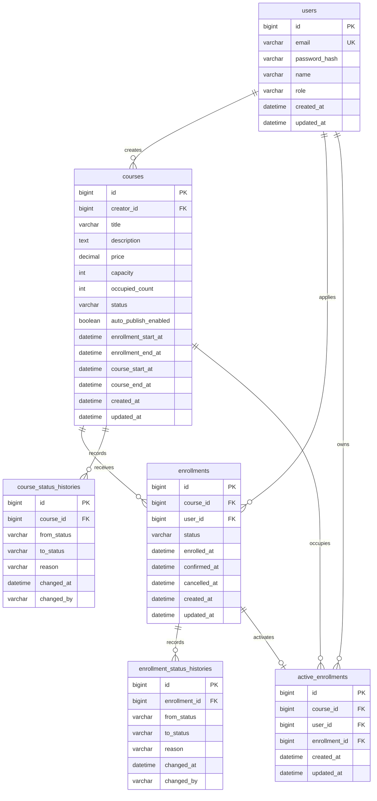

# Lklass 수강 신청 시스템

BE-A 과제 요구사항을 기준으로 구현한 Spring Boot 백엔드 API입니다.

## 프로젝트 개요

이 프로젝트는 강의 생성, 강의 상태 전이, 수강 신청, 결제 확정, 수강 취소를 다루는 수강 신청 시스템입니다.

핵심 목표는 단순 CRUD보다 다음 지점을 명확하게 보여주는 것입니다.

- Course 상태 전이: `DRAFT -> OPEN -> CLOSED`
- Enrollment 상태 전이: `PENDING -> CONFIRMED -> CANCELLED`
- 정원 점유 정책: `PENDING + CONFIRMED` 신청이 정원을 점유
- 정원 초과 방지: Course row의 조건부 원자 update로 좌석 확보
- 중복 활성 신청 방지: `active_enrollments` 테이블의 unique 제약
- 상태 변경 이력: Course/Enrollment 상태 변경을 append-only history로 기록
- 테스트 가능성: `Clock` 주입, Testcontainers MySQL, service/controller/entity 테스트
- 제출 검증: 전체 `./gradlew test` 통과

## 기술 스택

- Java 21
- Spring Boot 4.0.6
- Spring Web MVC
- Spring Data JPA
- Spring Security
- Bean Validation
- Flyway
- MySQL
- Testcontainers MySQL
- ShedLock
- JJWT
- Gradle Kotlin DSL

## 실행 방법

### 1. MySQL 실행

로컬 실행에는 MySQL이 필요합니다. `compose.yaml`로 MySQL 8.4를 바로 실행할 수 있습니다.

```bash
docker compose up -d
```

기존에 다른 설정으로 MySQL volume이 생성되어 있었다면 root 접속 권한이나 비밀번호 설정이 남아 있을 수 있습니다. 이 경우 아래처럼 volume을 삭제한 뒤 다시 실행합니다.

```bash
docker compose down -v
docker compose up -d
```

이미 로컬 MySQL을 사용 중이면 `DB_URL`, `DB_USERNAME`, `DB_PASSWORD` 환경 변수를 맞춰 실행하면 됩니다.

```bash
export DB_URL='jdbc:mysql://localhost:3306/lklass?serverTimezone=Asia/Seoul&characterEncoding=UTF-8'
export DB_USERNAME='root'
export DB_PASSWORD=''
export JWT_SECRET='local-dev-secret-change-me-32bytes-minimum'
```

### 2. 애플리케이션 실행

```bash
./gradlew bootRun
```

Flyway가 `src/main/resources/db/migration`의 migration을 적용하고, JPA는 `ddl-auto=validate`로 스키마 정합성을 검증합니다.

### 3. HTTP 시나리오 실행

애플리케이션을 실행한 뒤 `http` 디렉터리의 `.http` 파일을 실행하면 주요 시나리오를 확인할 수 있습니다.

```text
http/00-reset.http
http/01-auth.http
http/02-course.http
http/03-enrollment-payment-cancel.http
http/04-query-and-admin.http
```

각 파일은 JetBrains HTTP Client 기준으로 작성했습니다. 파일 간 실행 순서 의존성을 없애기 위해 시나리오 파일마다 필요한 회원가입, Course 생성, OPEN 준비 요청을 자체 포함합니다. 한 파일 안에서는 위에서 아래 순서대로 실행하면 됩니다.

HTTP 시나리오 실행 후 데이터를 초기화하려면 애플리케이션을 종료한 뒤 MySQL volume을 삭제하면 됩니다.

```bash
docker compose down -v
docker compose up -d
./gradlew bootRun
```

`down -v`는 로컬 MySQL 데이터를 모두 삭제합니다. 다시 애플리케이션을 실행하면 Flyway가 빈 DB에 migration을 적용합니다.

### 4. 테스트 실행

테스트는 Testcontainers MySQL을 사용하므로 Docker가 실행 중이어야 합니다.

```bash
./gradlew test
```

특정 도메인 테스트만 실행할 수도 있습니다.

```bash
./gradlew test --tests 'com.lklass.domain.course.*'
./gradlew test --tests 'com.lklass.domain.enrollment.*'
```

## 요구사항 해석 및 가정

- 인증/인가는 JWT 기반으로 단순화했습니다.
- 회원가입 시 `ADMIN`, `CREATOR`, `STUDENT` 역할을 직접 선택할 수 있습니다. 실제 운영 모델에서는 관리자 부여 절차가 별도로 필요하지만, 과제 검증 편의를 위해 열어두었습니다.
- Course 생성은 `CREATOR`와 `ADMIN`이 할 수 있습니다.
- `CREATOR`는 본인 Course만 관리할 수 있고, `ADMIN`은 모든 Course를 관리할 수 있습니다.
- 수강 신청, 결제 확정, 취소는 `STUDENT`만 할 수 있습니다.
- 외부 결제 시스템은 연동하지 않습니다. 결제 확정은 Enrollment의 상태를 `PENDING -> CONFIRMED`로 전이하는 API로 대체합니다.
- 정원은 `PENDING + CONFIRMED` 신청이 점유합니다. 결제 대기 중인 사용자의 좌석이 다른 사용자에게 빼앗기지 않게 하기 위한 정책입니다.
- `CANCELLED` 신청은 정원을 점유하지 않습니다.
- `CONFIRMED` 신청은 결제 확정 시각부터 7일 이내에만 취소할 수 있습니다.
- Course의 모집 마감 시각은 수강 시작 시각보다 이전이어야 합니다.
- Course 자동 게시/마감 스케줄러는 ShedLock으로 중복 실행을 방지합니다.

## 시나리오 구현 방식

과제의 배경 시나리오를 다음과 같은 흐름으로 해석하고 구현했습니다.

### 1. 크리에이터가 강의를 개설한다

크리에이터 또는 관리자는 Course를 생성합니다. Course 생성 시 제목, 설명, 가격, 정원, 모집 기간, 수강 기간을 함께 저장합니다.

생성 직후 Course는 `DRAFT` 상태입니다. `DRAFT`는 초안 상태이므로 수강 신청을 받을 수 없습니다. 이 상태를 둔 이유는 강의를 생성하자마자 바로 모집을 시작하기보다, 강의 정보와 모집 기간을 검토한 뒤 명시적으로 게시할 수 있게 하기 위해서입니다.

Course 게시 방식은 두 가지로 나누었습니다.

- 수동 OPEN: 크리에이터 또는 관리자가 지금 바로 모집을 시작하고 싶을 때 사용합니다.
- 자동 OPEN 예약: 크리에이터 또는 관리자가 모집 시작 시각에 맞춰 자동 게시되도록 예약할 때 사용합니다.

수동 OPEN은 요청 시점부터 모집을 시작하는 것으로 해석했습니다. 그래서 수동 OPEN API는 모집 마감 시각을 새로 받고, 모집 시작 시각은 현재 시각으로 갱신합니다. 단, 모집 마감 시각은 현재 시각보다 이후여야 하고, 수강 시작 시각보다 이전이어야 합니다. 이렇게 해야 수업이 시작된 뒤에도 신청을 받는 잘못된 Course가 생기지 않습니다.

자동 OPEN은 Course 생성 시 저장된 모집 시작/마감 기간을 그대로 사용합니다. 스케줄러가 주기적으로 `DRAFT + autoPublishEnabled = true + 모집 기간 도달` 조건을 만족하는 Course를 찾아 `OPEN`으로 전환합니다.

### 2. 클래스메이트가 수강 신청한다

클래스메이트는 `OPEN` 상태이고 모집 기간 안에 있는 Course에만 수강 신청할 수 있습니다. 수강 신청이 성공하면 Enrollment는 `PENDING` 상태로 생성됩니다.

`PENDING`은 신청은 완료됐지만 결제는 아직 끝나지 않은 상태입니다. 이 프로젝트에서는 외부 결제 시스템을 붙이지 않고, 결제 확정 API를 호출하면 `PENDING -> CONFIRMED`로 상태가 바뀌도록 구현했습니다.

### 3. 정원이 초과되면 신청을 막는다

정원은 `PENDING + CONFIRMED` 신청이 점유합니다. 결제 대기 상태인 사용자가 결제를 진행하는 동안 다른 사용자가 그 자리를 가져가면 사용자 경험이 좋지 않기 때문에, 신청 성공 시점에 좌석을 먼저 점유하도록 했습니다.

동시성 문제는 Course row의 조건부 원자 update로 처리합니다. 수강 신청 시 `occupiedCount < capacity` 조건을 만족할 때만 `occupiedCount`를 1 증가시킵니다. 여러 요청이 마지막 한 자리를 동시에 노려도 DB update 결과가 1인 요청만 좌석 확보에 성공하고, 나머지는 정원 초과로 실패합니다.

같은 사용자가 같은 Course에 동시에 여러 번 신청하는 문제는 `active_enrollments(course_id, user_id)` unique 제약으로 막습니다. 애플리케이션에서 먼저 중복 신청을 확인하고, 동시에 통과하는 race가 생겨도 DB unique 제약이 마지막 방어선으로 동작합니다.

### 4. 결제가 완료되어야 수강 확정된다

수강 신청 직후 상태는 `PENDING`입니다. 결제 확정 API를 호출하면 신청자 본인 여부를 확인한 뒤 `PENDING -> CONFIRMED`로 전이합니다. 이때 결제 확정 시각과 상태 이력을 함께 저장합니다.

이미 `CONFIRMED` 또는 `CANCELLED`인 신청을 다시 결제 확정하려고 하면 `INVALID_ENROLLMENT_STATUS`로 실패합니다.

### 5. 결제 대기 상태가 오래 유지되면 자동 만료한다

`PENDING` 신청도 정원을 점유하기 때문에, 사용자가 결제를 완료하지 않고 오래 방치하면 다른 사용자가 신청하지 못하는 문제가 생깁니다. 그래서 결제 대기 TTL을 30분으로 정했습니다.

`EnrollmentExpirationScheduler`는 30분을 초과한 `PENDING` 신청을 찾아 `CANCELLED`로 변경합니다. 이때 Enrollment 원장 row는 삭제하지 않습니다. 대신 상태를 `CANCELLED`로 바꾸고 `cancelledAt`을 기록해 이력을 남깁니다. 실제 좌석 점유를 나타내는 `active_enrollments` row만 삭제하고, Course의 `occupiedCount`를 감소시켜 다른 사용자가 신청할 수 있게 합니다.

즉 "만료 삭제"는 신청 원장을 물리 삭제하는 것이 아니라, 활성 점유를 해제하고 상태 이력에 `EXPIRED`를 남기는 방식으로 구현했습니다.

### 6. 수강 확정 후 일정 기간 내에만 취소할 수 있다

`PENDING` 신청은 결제 전이므로 바로 취소할 수 있습니다. `CONFIRMED` 신청은 결제 확정 시각부터 7일 이내에만 취소할 수 있습니다.

취소가 성공하면 Enrollment 상태는 `CANCELLED`가 되고, `cancelledAt`이 기록됩니다. 또한 `active_enrollments` row를 삭제하고 Course의 `occupiedCount`를 감소시켜 좌석을 반납합니다.

결제 후 7일이 지난 `CONFIRMED` 신청을 취소하려고 하면 `CANCELLATION_PERIOD_EXPIRED`로 실패합니다.

## 설계 결정과 이유

### Course 상태 모델

Course는 `DRAFT`, `OPEN`, `CLOSED` 상태를 가집니다.

- `DRAFT`: 생성 직후 상태, 수강 신청 불가
- `OPEN`: 수강 신청 가능
- `CLOSED`: 수강 신청 불가

상태 전이는 도메인 메서드로 제한합니다.

- 수동 게시: `openManually`
- 수동 마감: `close`
- 예약 게시: `reserveAutoPublish`
- 자동 게시: `openAutomatically`
- 자동 마감: `closeAutomatically`

잘못된 상태 전이는 `INVALID_COURSE_STATUS_TRANSITION`으로 실패합니다.

### Enrollment 상태 모델

Enrollment는 `PENDING`, `CONFIRMED`, `CANCELLED` 상태를 가집니다.

- `PENDING`: 수강 신청 완료, 결제 대기
- `CONFIRMED`: 결제 확정
- `CANCELLED`: 신청 취소

구현된 전이는 다음과 같습니다.

- `PENDING -> CONFIRMED`: 결제 확정
- `PENDING -> CANCELLED`: 결제 전 취소
- `CONFIRMED -> CANCELLED`: 결제 후 7일 이내 취소
- `PENDING -> CANCELLED`: 30분 결제 대기 만료

잘못된 상태 전이는 `INVALID_ENROLLMENT_STATUS`로 실패합니다.

### 정원 초과 방지

정원 확보는 Course row에 대해 조건부 update를 사용합니다.

```sql
update courses
   set occupied_count = occupied_count + 1
 where id = ?
   and status = 'OPEN'
   and enrollment_start_at <= ?
   and ? < enrollment_end_at
   and occupied_count < capacity
```

업데이트 결과가 1이면 좌석 확보 성공, 0이면 신청 불가 또는 정원 초과로 해석합니다. 이 방식은 `count < capacity` 조회 후 증가시키는 방식보다 마지막 좌석 경쟁에서 안전합니다.

### 중복 활성 신청 방지

MySQL은 PostgreSQL처럼 partial unique index를 직접 쓰기 어렵기 때문에 `active_enrollments` 테이블을 별도로 둡니다.

- `active_enrollments(course_id, user_id)` unique 제약으로 같은 Course/User의 활성 신청 중복을 막습니다.
- `PENDING`과 `CONFIRMED`는 활성 신청으로 봅니다.
- 취소 시 `active_enrollments` row를 삭제합니다.

### 상태 이력

Course와 Enrollment 모두 상태 변경 이력을 별도 history 테이블에 append-only로 저장합니다.

- `course_status_histories`
- `enrollment_status_histories`

이력에는 이전 상태, 다음 상태, 변경 사유, 변경 시각, 변경 주체를 저장합니다.

### 시간 정책

애플리케이션 시간은 `Clock` bean을 통해 주입합니다. 테스트에서는 fixed `Clock`을 사용해 결제 확정 시각, 취소 가능 기간, scheduler 경계를 결정적으로 검증합니다.

### Scheduler

Course 예약 게시와 모집 마감은 `CourseStatusScheduler`가 처리합니다.

- 예약된 DRAFT Course 자동 OPEN
- 모집 마감된 OPEN Course 자동 CLOSED
- ShedLock으로 다중 인스턴스 중복 실행 방지
- 테스트 프로파일에서는 background scheduler bean을 비활성화해 테스트 흔들림을 방지

Enrollment 결제 대기 만료는 `EnrollmentExpirationScheduler`가 처리합니다.

- `PENDING` 상태로 30분을 초과한 신청 자동 `CANCELLED`
- 만료 시 `active_enrollments` row 삭제
- 만료 시 Course `occupiedCount` 감소
- 상태 이력에 `EXPIRED` 사유와 `SYSTEM` 변경 주체 기록

## 데이터 모델 설명



### users

회원 계정입니다.

- `id`
- `email`
- `password_hash`
- `name`
- `role`: `ADMIN`, `CREATOR`, `STUDENT`

### courses

강의입니다.

- `creator_id`: Course 소유 강사
- `title`, `description`
- `price`: `DECIMAL(12,2)`
- `capacity`: 정원
- `occupied_count`: 현재 점유 좌석 수
- `status`: `DRAFT`, `OPEN`, `CLOSED`
- `auto_publish_enabled`: 자동 게시 예약 여부
- `enrollment_start_at`, `enrollment_end_at`
- `course_start_at`, `course_end_at`

주요 제약:

- `capacity >= 1`
- `occupied_count >= 0`
- `occupied_count <= capacity`
- `enrollment_start_at < enrollment_end_at`
- `course_start_at < course_end_at`

### enrollments

수강 신청 원장입니다.

- `course_id`
- `user_id`
- `status`: `PENDING`, `CONFIRMED`, `CANCELLED`
- `enrolled_at`
- `confirmed_at`
- `cancelled_at`

30분을 초과한 `PENDING` 신청은 scheduler에 의해 `CANCELLED`로 변경되고, `cancelled_at`에 만료 처리 시각을 저장합니다.

### active_enrollments

활성 신청 점유 테이블입니다.

- `course_id`
- `user_id`
- `enrollment_id`
- unique `(course_id, user_id)`
- unique `(enrollment_id)`

`PENDING`과 `CONFIRMED` 신청은 이 테이블에 row를 유지합니다. 취소되면 삭제합니다.

### course_status_histories

Course 상태 변경 감사 이력입니다.

- `course_id`
- `from_status`
- `to_status`
- `reason`
- `changed_at`
- `changed_by`

### enrollment_status_histories

Enrollment 상태 변경 감사 이력입니다.

- `enrollment_id`
- `from_status`
- `to_status`
- `reason`
- `changed_at`
- `changed_by`

만료 처리는 `reason = EXPIRED`, `changed_by = SYSTEM`으로 저장합니다.

## API 목록 및 예시

모든 성공 응답은 다음 형태를 사용합니다.

```json
{
  "success": true,
  "data": {}
}
```

실패 응답은 다음 형태를 사용합니다.

```json
{
  "success": false,
  "code": "ERROR_CODE",
  "message": "error message",
  "traceId": "..."
}
```

### 회원가입

```bash
curl -X POST http://localhost:8080/api/auth/signup \
  -H 'Content-Type: application/json' \
  -d '{
    "email": "creator@example.com",
    "password": "password123",
    "name": "Creator",
    "role": "CREATOR"
  }'
```

응답:

```json
{
  "success": true,
  "data": {
    "accessToken": "..."
  }
}
```

### 로그인

```bash
curl -X POST http://localhost:8080/api/auth/login \
  -H 'Content-Type: application/json' \
  -d '{
    "email": "creator@example.com",
    "password": "password123"
  }'
```

### Course 생성

`CREATOR`는 본인 명의로 생성할 수 있고, `ADMIN`은 `creatorId`를 지정해 대리 생성할 수 있습니다.

```bash
curl -X POST http://localhost:8080/api/courses \
  -H 'Authorization: Bearer <CREATOR_TOKEN>' \
  -H 'Content-Type: application/json' \
  -d '{
    "title": "Spring Boot 입문",
    "description": "수강 신청 시스템으로 배우는 Spring Boot",
    "price": 10000.00,
    "capacity": 30,
    "enrollmentStartAt": "2026-06-01T10:00:00",
    "enrollmentEndAt": "2026-06-10T18:00:00",
    "courseStartAt": "2026-06-15T10:00:00",
    "courseEndAt": "2026-07-15T18:00:00"
  }'
```

### Course 목록 조회

```bash
curl 'http://localhost:8080/api/courses?status=OPEN&page=1&size=10'
```

요청과 응답의 `page`는 사용자 친화적인 1-base 값으로 사용합니다. 정렬 기본값은 `createdAt,DESC`입니다.

### Course 상세 조회

```bash
curl http://localhost:8080/api/courses/1
```

응답에는 `occupiedCount`가 포함됩니다.

### Course 수동 OPEN

```bash
curl -X PATCH http://localhost:8080/api/courses/1/open \
  -H 'Authorization: Bearer <CREATOR_OR_ADMIN_TOKEN>' \
  -H 'Content-Type: application/json' \
  -d '{
    "enrollmentEndAt": "2026-06-10T18:00:00"
  }'
```

### Course 수동 CLOSED

```bash
curl -X PATCH http://localhost:8080/api/courses/1/close \
  -H 'Authorization: Bearer <CREATOR_OR_ADMIN_TOKEN>'
```

### Course 자동 게시 예약

```bash
curl -X POST http://localhost:8080/api/courses/1/publish-reservation \
  -H 'Authorization: Bearer <CREATOR_OR_ADMIN_TOKEN>'
```

### 수강 신청 생성

`STUDENT`만 호출할 수 있습니다.

```bash
curl -X POST http://localhost:8080/api/courses/1/enrollments \
  -H 'Authorization: Bearer <STUDENT_TOKEN>'
```

응답:

```json
{
  "success": true,
  "data": {
    "id": 10,
    "courseId": 1,
    "userId": 3,
    "status": "PENDING",
    "enrolledAt": "2026-05-16T10:00:00"
  }
}
```

### 결제 확정

외부 결제 연동 없이 `PENDING -> CONFIRMED` 상태 전이로 처리합니다. 신청자 본인만 호출할 수 있습니다.

```bash
curl -X POST http://localhost:8080/api/enrollments/10/confirm-payment \
  -H 'Authorization: Bearer <STUDENT_TOKEN>'
```

### 수강 취소

`PENDING` 신청은 바로 취소할 수 있습니다. `CONFIRMED` 신청은 결제 확정 후 7일 이내에만 취소할 수 있습니다.

```bash
curl -X POST http://localhost:8080/api/enrollments/10/cancel \
  -H 'Authorization: Bearer <STUDENT_TOKEN>'
```

취소에 성공하면 `active_enrollments` row를 삭제하고 Course의 `occupiedCount`를 1 감소시킵니다.

### 내 수강 신청 목록 조회

`STUDENT` 본인의 수강 신청 목록을 페이지로 조회합니다.

```bash
curl 'http://localhost:8080/api/me/enrollments?page=1&size=10' \
  -H 'Authorization: Bearer <STUDENT_TOKEN>'
```

응답 예시:

```json
{
  "success": true,
  "data": {
    "content": [
      {
        "id": 10,
        "courseId": 1,
        "courseTitle": "Spring Boot 입문",
        "userId": 3,
        "userName": "Student",
        "userEmail": "student@example.com",
        "status": "CONFIRMED",
        "enrolledAt": "2026-05-16T10:00:00",
        "confirmedAt": "2026-05-16T10:05:00",
        "cancelledAt": null
      }
    ],
    "page": 1,
    "size": 10,
    "totalElements": 1,
    "totalPages": 1
  }
}
```

### Course별 수강생 목록 조회

`CREATOR`는 본인 Course의 수강생만 조회할 수 있고, `ADMIN`은 모든 Course 수강생을 조회할 수 있습니다.

```bash
curl 'http://localhost:8080/api/courses/1/students?page=1&size=10' \
  -H 'Authorization: Bearer <CREATOR_OR_ADMIN_TOKEN>'
```

## 현재 구현 상태

완료된 항목:

- 인증/인가 기초
- Course 생성, 목록, 상세, 상태 전이, 게시 예약, 자동 게시/마감 scheduler
- Course 상태 이력
- Enrollment 생성
- Course 정원 원자성 update
- 활성 수강 신청 중복 방지
- 결제 확정
- 수강 취소
- 30분 초과 `PENDING` 신청 자동 만료
- 내 수강 신청 목록 조회
- Course별 수강생 목록 조회
- 정원 5명 Course에 100건 virtual-thread 동시 신청 통합 테스트
- Enrollment 상태 이력
- 위 기능에 대한 entity/service/controller/persistence 테스트

## 테스트 실행 방법

전체 테스트:

```bash
./gradlew test
```

주요 테스트 범위:

```bash
./gradlew test --tests 'com.lklass.domain.auth.*'
./gradlew test --tests 'com.lklass.domain.course.*'
./gradlew test --tests 'com.lklass.domain.enrollment.*'
```

현재 테스트는 다음을 검증합니다.

- 인증/인가 성공과 실패
- Course 생성, 목록, 상세 조회
- Course 상태 전이 성공/실패
- Course 자동 게시/자동 마감 scheduler 호출 계약
- Enrollment 생성 성공/실패
- 정원 초과 신청 거부
- 중복 활성 신청 거부
- 결제 확정 성공/실패
- 취소 성공/실패와 취소 가능 기간
- 30분 초과 `PENDING` 신청 만료
- 만료된 `PENDING` 신청 결제 확정 거부
- 만료 후 좌석 반납과 다른 학생 재신청 가능
- 내 수강 신청 목록 조회
- Course별 수강생 목록 조회
- 정원 5명 Course에 100건 virtual-thread 동시 신청 시 정원 초과 방지
- 상태 이력 저장
- Flyway migration과 주요 DB 제약

제출 전 확인한 명령:

```bash
./gradlew test
```

## 미구현 / 제약사항

- 외부 결제 시스템, 결제 거래 원장, 환불 도메인은 구현하지 않았습니다.
- 대기열(waitlist)은 구현하지 않았습니다.
- 관리자 권한 부여 절차는 단순화되어 회원가입 요청에서 role을 선택합니다.
- 운영용 배포 설정은 제공하지 않습니다.
- 목록 조회는 기본 페이지네이션을 제공하지만, 다양한 검색 조건과 정렬 조합은 제한적으로만 지원합니다.

## AI 활용 범위

AI는 단발성 코드 생성 도구가 아니라, 과제 진행을 통제하기 위한 5단계 워크플로우와 하위 에이전트 형태로 사용했습니다. 각 단계는 서로 다른 목적을 갖고, 필요한 스킬을 조합해 산출물을 검토한 뒤 다음 단계로 넘기는 방식으로 운영했습니다.

| 단계 | 사용한 하위 에이전트/스킬 | 사용 이유 | 사용 방식 |
| --- | --- | --- | --- |
| 1. Design | `assignment-designer`, `lklass-conventions-check` | 구현 전에 요구사항 해석, 상태 전이, 정원 정책, 동시성 전략을 먼저 확정하기 위해 사용했습니다. | BE-A 요구사항을 기준으로 기술 스택, 인증 단순화 방식, Course/Enrollment 상태 전이, 정원 점유 기준, 취소 정책, API 목록, 테스트 계획을 정리했습니다. 이 결과를 `implementation_plan.md`로 만들고, 구현 전에 승인된 설계 기준으로 사용했습니다. |
| 2. Implement | `vertical-slicer`, `spring-implementer`, `lklass-conventions-check`, `diagnose` | 큰 기능을 한 번에 구현하지 않고, 리뷰 가능한 작은 수직 slice로 나누기 위해 사용했습니다. | 설계안을 Course 생성/조회, Course 상태 전이, Enrollment 생성, 결제 확정, 취소 같은 slice로 나누고 `task.md`에 기록했습니다. 각 slice는 Controller-Service-Repository-Entity-Test 흐름을 가능한 한 함께 갖도록 구성했습니다. 구현 중 실패가 발생하면 `diagnose` 절차에 따라 재현, 원인 가설, 최소 수정, 회귀 테스트 순서로 처리했습니다. |
| 3. Test | `test-planner`, `lklass-conventions-check`, `diagnose` | 정상 흐름뿐 아니라 실패 케이스와 경계 조건을 빠뜨리지 않기 위해 사용했습니다. | 테스트 작성 전에 강의 생성/목록/상세, 상태 전이 성공/실패, DRAFT/CLOSED 신청 거부, 정원 초과, 중복 신청, 결제 확정, 취소 가능 기간 같은 테스트 매트릭스를 먼저 정리했습니다. 이후 slice별 focused test를 실행하고, 실패한 테스트는 원인을 좁혀 수정했습니다. |
| 4. Review | `lklass-conventions-check`, review 하위 에이전트 | 구현이 단순히 동작하는지를 넘어 요구사항 충족, 유지보수성, 네이밍, 트랜잭션 경계, 성능 관점까지 점검하기 위해 사용했습니다. | 변경 파일을 기준으로 필수 요구사항 누락, 상태 전이 오류, 정원 초과 위험, 동시성 취약점, API 계약 불일치, 테스트 누락, README 누락을 반복 리뷰했습니다. 리뷰에서 발견된 항목은 우선순위를 매기고, 필요한 경우 별도 수정 slice로 반영했습니다. |
| 5. Inspect | `lklass-conventions-check`, `diagnose` | 제출 전 최종 품질 게이트를 통과시키기 위해 사용했습니다. | `git status`로 변경 범위를 확인하고, README 필수 섹션, API 예시, 데이터 모델 설명, 실행 방법, AI 활용 범위를 점검했습니다. 가능한 경우 `./gradlew test`를 통해 전체 테스트를 확인하고, 실패 시 `diagnose` 절차로 원인을 분석하도록 했습니다. |

이 방식으로 AI를 사용한 이유는 구현 속도를 높이는 것뿐 아니라, 과제 평가에서 중요한 판단 과정을 문서화하고 누락을 줄이기 위해서였습니다. 특히 수강 신청 시스템은 상태 전이, 정원 점유, 결제 확정, 취소, 동시성처럼 서로 영향을 주는 규칙이 많기 때문에, 설계/구현/테스트/리뷰/검수 역할을 분리해 반복 확인하는 방식이 더 안전하다고 판단했습니다.

AI가 제안한 내용은 그대로 반영하지 않았습니다. 최종 반영 여부는 직접 코드 구조를 확인하고, 테스트 실행 결과와 리뷰 워크플로우의 finding을 기준으로 결정했습니다.
