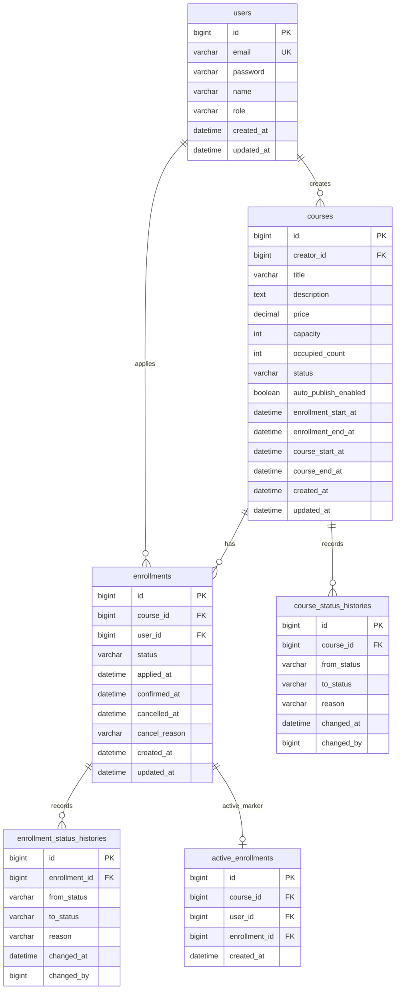

# BE-A 수강 신청 시스템 구현 계획

status: draft

## 1. 프로젝트 목표

BE-A 과제인 수강 신청 시스템을 Spring Boot 기반 백엔드 API로 구현한다. 단순 CRUD보다 상태 전이, 정원 관리, 동시성 제어, 결제 대기/취소 정책, 테스트 가능성을 명확히 보여주는 것을 목표로 한다.

주요 목표는 다음과 같다.

- 강의 생성, 모집 상태 전환, 목록/상세 조회
- 수강 신청, 결제 확정, 취소, 내 신청 목록 조회
- 정원 초과 방지와 동일 사용자 중복 신청 방지
- 동시 요청 상황에서도 정원이 초과되지 않는 검증
- JWT 기반 인증/인가와 역할별 API 접근 제어
- README에 실행 방법, API 예시, 데이터 모델, 설계 결정, AI 활용 범위 명시

## 2. 비목표

다음 항목은 이번 구현의 비목표로 둔다.

- 외부 결제 시스템 연동
- refresh token, OAuth, 이메일 인증, 비밀번호 재설정
- 수강 대기열(waitlist)
- 강의/회원/수강 신청 삭제 API
- 강의 영상/콘텐츠 제공 기능
- 운영 수준의 관리자 백오피스
- Redis 기반 재고 관리 또는 분산락
- QueryDSL 초기 도입

QueryDSL은 강의/신청 목록 검색 조건이 복잡해질 경우 후속 도입 대상으로 둔다.

## 3. 기술 스택

- Language: Java 21
- Framework: Spring Boot
- Persistence: Spring Data JPA
- Database: MySQL
- Test DB: Testcontainers MySQL
- DB Migration: Flyway
- Authentication: Spring Security + JWT access token
- Test: JUnit 5, Spring Boot Test, Testcontainers
- Threading: Java 21 virtual threads 사용
- Scheduler Lock: ShedLock

금액은 `BigDecimal`로 표현하고 DB에서는 `DECIMAL(12, 2)`를 사용한다. `double`, `float`는 사용하지 않는다.

DB 스키마는 JPA `ddl-auto`에 의존하지 않고 Flyway migration으로 관리한다. JPA 설정은 local/test에서 검증 편의를 고려하되, 기본 방향은 `ddl-auto=validate`로 두어 엔티티와 migration 불일치를 빠르게 발견한다.

## 3-1. 설정 관리와 시간 제어

설정은 yml에 분리하고, 코드에서는 `@Value`를 직접 흩뿌리지 않는다. 타입 안정성과 테스트 편의를 위해 `@ConfigurationProperties`를 사용한다.

권장 설정 파일:

```text
application.yml
application-local.yml
application-test.yml
application-prod.yml
```

필요하면 관심사별 설정 파일을 `config/` 아래에 두고 `spring.config.import`로 불러온다.

```text
config/application-db.yml
config/application-security.yml
config/application-scheduler.yml
config/application-policy.yml
```

권장 properties:

```java
@ConfigurationProperties(prefix = "lklass.jwt")
public record JwtProperties(
    String secret,
    Duration accessTokenTtl
) {
}
```

```java
@ConfigurationProperties(prefix = "lklass.policy")
public record EnrollmentPolicyProperties(
    Duration pendingPaymentTtl,
    Duration cancellationPeriod
) {
}
```

```java
@ConfigurationProperties(prefix = "lklass.scheduler")
public record SchedulerProperties(
    String courseStatusCron,
    String pendingExpirationCron
) {
}
```

설정 예:

```yaml
lklass:
  jwt:
    secret: ${JWT_SECRET:local-dev-secret}
    access-token-ttl: 1h
  policy:
    pending-payment-ttl: 30m
    cancellation-period: 7d
  scheduler:
    course-status-cron: "0 * * * * *"
    pending-expiration-cron: "0 * * * * *"
```

시간 정책은 반드시 `Clock`을 주입해 처리한다. `LocalDateTime.now()` 또는 `Instant.now()`를 도메인/서비스 코드에서 직접 호출하지 않는다.

적용 대상:

- 모집 시작/마감 검증
- Course 자동 OPEN/CLOSED 스케줄러
- PENDING 30분 만료
- 결제 확정 후 7일 이내 취소 검증
- 상태 이력의 `changedAt`
- 신청/확정/취소 시각 기록

운영 설정:

```java
@Bean
Clock clock() {
    return Clock.systemDefaultZone();
}
```

테스트에서는 fixed clock을 주입해 시간 경계 조건을 결정적으로 검증한다.

## 4. 용어와 네이밍

과제 원문은 강의를 `Class`라고 부르지만, Java의 `Class` 타입과 혼동을 피하기 위해 코드와 API에서는 `Course`로 명명한다.

- 과제 용어: Class
- 코드/API 용어: Course
- API base path: `/api/courses`

## 4-1. 애플리케이션 아키텍처

과제 규모를 고려해 완전한 hexagonal architecture까지는 적용하지 않는다. 대신 `mate` 프로젝트의 단순한 global 공통 구조와 `soomsoom` 프로젝트의 이벤트 처리 아이디어를 참고해, 읽기 쉬운 layered architecture를 사용한다.

권장 패키지 구조:

```text
com.lklass
  global
    common
    exception
    logging
    security
    event
    config
  domain
    user
    auth
    course
    enrollment
```

각 도메인은 필요한 경우 아래 하위 패키지를 가진다.

```text
controller
service
repository
entity
dto
event
```

원칙:

- Controller는 요청/응답 DTO 변환과 인증 사용자 전달만 담당한다.
- Service는 use case와 트랜잭션 경계를 담당한다.
- Entity는 상태 전이 같은 핵심 도메인 규칙을 메서드로 표현한다.
- Repository는 JPA 접근만 담당한다.
- 공통 응답, 예외, 로깅, 보안, 이벤트 기반 시설은 `global`에 둔다.
- 과제 가독성을 우선해 포트/어댑터 계층은 도입하지 않는다.

## 4-2. 도메인 경계

도메인은 다음 기준으로 나눈다.

```text
domain.user
domain.auth
domain.course
domain.enrollment
```

`payment`는 초기 독립 도메인으로 분리하지 않는다. 과제의 결제 확정은 외부 결제 연동 없이 `Enrollment`의 상태 전이인 `PENDING -> CONFIRMED`로 대체되기 때문이다. 실제 결제 승인, 결제 거래, 환불, PG 연동이 생기면 그때 `domain.payment`를 분리한다.

### domain.user

회원과 역할을 담당한다.

- `User`
- `UserRole`
- 사용자 조회
- 이메일 중복 검증
- 비밀번호 저장용 hash

`User`는 Course와 Enrollment의 행위 주체이지만, 수강 신청 규칙을 직접 알지 않는다.

### domain.auth

인증과 토큰 발급을 담당한다.

- signup
- login
- JWT 발급/검증
- Security principal 구성

`auth`는 `user`를 사용해 인증을 수행하지만, Course/Enrollment 비즈니스 규칙에는 의존하지 않는다.

### domain.course

강의 자체와 모집 상태, 정원 카운터를 담당한다.

- `Course`
- `CourseStatus`
- `CourseStatusHistory`
- Course 생성/수정
- 게시/모집 예약
- 수동 OPEN/CLOSED
- 자동 OPEN/CLOSED scheduler
- 정원 카운터 증가/감소 repository operation
- 강의 목록/상세 조회
- 강의별 수강생 목록 조회의 Course 소유자 권한 검증

`Course`는 `Enrollment` 목록을 객체 그래프로 직접 소유하지 않는다. 신청은 별도 도메인인 `enrollment`에서 관리한다. Course는 정원과 모집 상태라는 신청 가능 조건만 제공한다.

### domain.enrollment

수강 신청의 lifecycle을 담당한다.

- `Enrollment`
- `EnrollmentStatus`
- `EnrollmentStatusHistory`
- `ActiveEnrollment`
- 수강 신청 생성
- 결제 확정 처리
- 수강 취소
- PENDING 만료 처리
- 내 수강 신청 목록
- 중복 신청 방지

`Enrollment`는 Course의 정원 확보/release 기능을 호출하지만, Course의 상세 상태 변경 정책을 직접 소유하지 않는다. 반대로 Course도 Enrollment 상태 전이 규칙을 직접 알지 않는다.

### 결제 확정 위치

현재 구현에서는 결제 확정 API를 `domain.enrollment`에 둔다.

```text
PATCH /api/enrollments/{enrollmentId}/confirm-payment
```

이유:

- 과제에서 외부 결제 시스템 연동은 불필요하다.
- 결제 확정은 별도 결제 거래 생성이 아니라 Enrollment 상태 전이다.
- 취소 가능 기간도 `confirmedAt`을 기준으로 Enrollment가 판단한다.

후속 확장으로 실제 결제 도메인이 생기면 다음처럼 바꿀 수 있다.

```text
domain.payment
- Payment
- PaymentTransaction
- PaymentConfirmedEvent
- RefundRequestedEvent
```

그때는 Payment가 결제 성공 이벤트를 발행하고, Enrollment가 이를 받아 `CONFIRMED`로 전이하는 구조로 확장한다.

### 도메인 간 직접 참조 원칙

- Controller는 다른 도메인의 Repository를 직접 호출하지 않는다.
- Service는 필요한 경우 다른 도메인의 Service/Facade를 통해 협력한다.
- Entity 간 양방향 연관관계는 최소화한다.
- `Course.creatorId`, `Enrollment.userId`, `Enrollment.courseId`처럼 id 참조를 기본으로 두고, 조회 응답에서 필요한 정보는 Service/Repository query로 조합한다.
- 필수 정합성 처리의 흐름은 서비스 코드에 명시한다.
- 이벤트는 후속 반응과 확장 포인트에 사용한다.

### 삭제 정책

1차 구현에서는 삭제 API를 제공하지 않는다.

이유:

- 과제 필수 구현에 삭제 API가 명시되어 있지 않다.
- 수강 신청은 삭제보다 `CANCELLED` 상태 전이와 이력 보존이 더 중요하다.
- Course는 삭제보다 `CLOSED` 상태로 모집 종료를 표현하는 것이 자연스럽다.
- 이미 신청/결제/상태 이력이 있는 데이터를 hard delete하면 감사 추적과 정합성이 약해진다.
- User 삭제는 연관 신청/강의/이력 데이터 보존 또는 비식별화 정책이 필요해 과제 범위를 넘는다.

정책:

- Course 삭제 없음
- Enrollment 삭제 없음
- User 삭제 없음
- 수강 신청 취소는 `Enrollment.status = CANCELLED`로 표현
- 강의 모집 종료는 `Course.status = CLOSED`로 표현

후속 확장 시 권장 정책:

- Course soft delete는 `DRAFT`이고 신청 이력이 없는 경우에만 허용
- 신청 이력이 있는 Course는 삭제 대신 `CLOSED`
- Enrollment는 물리 삭제하지 않고 상태 이력과 함께 보존
- User 삭제는 soft delete 또는 비식별화로 별도 설계

## 4-3. Repository 구현 방식

포트/어댑터 구조는 도입하지 않지만, Service가 Spring Data JPA repository를 직접 의존하지 않도록 한 겹 감싼 Repository 컴포넌트를 둔다.

목표:

- Service는 도메인 관점의 repository 메서드만 사용한다.
- Spring Data JPA 쿼리 메서드, `@Modifying` bulk update, QueryDSL 도입 여부는 repository 내부로 숨긴다.
- atomic conditional update 같은 DB 의존 구현을 Service에서 감춘다.
- 테스트에서는 Service의 비즈니스 흐름과 Repository의 DB 동작을 분리해 검증하기 쉽도록 한다.

권장 구조:

```text
domain.course.repository
  CourseRepository.java          // 서비스가 주입받는 repository component
  CourseJpaRepository.java       // Spring Data JpaRepository
  CourseQueryRepository.java     // 복잡 조회/QueryDSL 도입 시 사용
```

예시:

```java
@Repository
public class CourseRepository {

    private final CourseJpaRepository courseJpaRepository;

    public CourseRepository(CourseJpaRepository courseJpaRepository) {
        this.courseJpaRepository = courseJpaRepository;
    }

    public Course save(Course course) {
        return courseJpaRepository.save(course);
    }

    public Optional<Course> findById(Long courseId) {
        return courseJpaRepository.findById(courseId);
    }

    public boolean tryOccupySeat(Long courseId, LocalDateTime now) {
        return courseJpaRepository.tryOccupySeat(courseId, now) == 1;
    }
}
```

```java
interface CourseJpaRepository extends JpaRepository<Course, Long> {

    @Modifying(flushAutomatically = true)
    @Query("""
        update Course c
           set c.occupiedCount = c.occupiedCount + 1
         where c.id = :courseId
           and c.status = 'OPEN'
           and c.enrollmentStartAt <= :now
           and c.enrollmentEndAt >= :now
           and c.occupiedCount < c.capacity
    """)
    int tryOccupySeat(Long courseId, LocalDateTime now);
}
```

Service 사용 예시:

```java
@Service
public class EnrollmentService {

    private final CourseRepository courseRepository;
    private final EnrollmentRepository enrollmentRepository;
    private final ActiveEnrollmentRepository activeEnrollmentRepository;

    // ...
}
```

네이밍 원칙:

- 서비스가 주입받는 것은 `CourseRepository`, `EnrollmentRepository` 같은 도메인 repository component다.
- Spring Data 인터페이스는 `CourseJpaRepository`, `EnrollmentJpaRepository`처럼 `Jpa` 접미사를 붙인다.
- 복잡한 목록 조회가 필요해지면 `CourseQueryRepository`, `EnrollmentQueryRepository`를 추가한다.
- 이번 과제에서는 JPA Entity와 domain model을 분리하지 않는다. 즉 `Course` Entity가 도메인 메서드도 가진다.

## 5. 인증/인가 설계

처음부터 Spring Security와 JWT를 사용한다.

### 사용자

`User` 엔티티를 둔다.

- `id`
- `email`
- `password`
- `name`
- `role`

역할은 다음 세 가지다.

- `ADMIN`
- `CREATOR`
- `STUDENT`

과제 및 테스트 편의를 위해 회원가입 시 `ADMIN`, `CREATOR`, `STUDENT`를 모두 선택 가능하게 한다. 운영 보안 모델로는 엄격하지 않지만, README에 과제 편의를 위한 단순화라고 명시한다.

### 인증 API

- `POST /api/auth/signup`
- `POST /api/auth/login`

로그인 성공 시 JWT access token을 반환한다. JWT claim에는 최소한 `userId`, `role`을 포함한다.

### 권한 정책

- `ADMIN`: 전체 관리 권한
- `CREATOR`: 본인이 만든 강의 생성/관리, 본인 강의 수강생 목록 조회
- `STUDENT`: 수강 신청, 결제 확정, 취소, 내 신청 목록 조회

권한 검증은 `@PreAuthorize`와 서비스 레벨 소유자 검증을 함께 사용한다.

## 6. 도메인 모델

### Course

강의 현재 상태와 정원 카운터를 저장한다.

- `id`
- `creatorId`
- `title`
- `description`
- `price`
- `capacity`
- `occupiedCount`
- `status`
- `autoPublishEnabled`
- `enrollmentStartAt`
- `enrollmentEndAt`
- `courseStartAt`
- `courseEndAt`
- `createdAt`
- `updatedAt`

검증 규칙:

- 가격은 0 이상
- 정원은 1 이상
- `enrollmentStartAt < enrollmentEndAt`
- `courseStartAt < courseEndAt`

### CourseStatus

- `DRAFT`: 초안, 신청 불가
- `OPEN`: 모집 중, 신청 가능
- `CLOSED`: 모집 마감, 신청 불가

허용 전이:

| From | To | Reason |
| --- | --- | --- |
| null | DRAFT | 생성 |
| DRAFT | OPEN | 수동 모집 시작 또는 자동 모집 시작 |
| OPEN | CLOSED | 수동 모집 마감 또는 자동 모집 마감 |

### CourseStatusHistory

강의 상태 변경 이력을 append-only로 저장한다.

- `id`
- `courseId`
- `fromStatus`
- `toStatus`
- `reason`
- `changedAt`
- `changedBy`

reason 예시:

- `CREATED`
- `MANUAL_OPENED`
- `MANUAL_CLOSED`
- `AUTO_OPENED`
- `AUTO_CLOSED`

스케줄러가 변경한 경우 `changedBy`는 `SYSTEM` 또는 null로 둔다.

### Enrollment

수강 신청의 현재 상태와 주요 시각을 저장한다.

- `id`
- `courseId`
- `userId`
- `status`
- `appliedAt`
- `confirmedAt`
- `cancelledAt`
- `cancelReason`
- `createdAt`
- `updatedAt`

### EnrollmentStatus

- `PENDING`: 신청 완료, 결제 대기
- `CONFIRMED`: 결제 완료, 수강 확정
- `CANCELLED`: 취소됨

허용 전이:

| From | To | 의미 |
| --- | --- | --- |
| null | PENDING | 수강 신청 생성 |
| PENDING | CONFIRMED | 결제 확정 |
| PENDING | CANCELLED | 결제 전 사용자 취소 또는 결제 대기 만료 |
| CONFIRMED | CANCELLED | 결제 후 사용자 취소 |

`CANCELLED` 이후의 재신청은 기존 row를 되살리지 않고 새 `Enrollment` row를 생성한다.

### EnrollmentStatusHistory

신청 상태 변경 이력을 append-only로 저장한다.

- `id`
- `enrollmentId`
- `fromStatus`
- `toStatus`
- `reason`
- `changedAt`
- `changedBy`

reason 예시:

- `APPLIED`
- `PAYMENT_CONFIRMED`
- `USER_REQUESTED`
- `PENDING_EXPIRED`
- `ADMIN_CANCELLED`

### ActiveEnrollment

현재 활성 신청만 저장하는 인덱스성 테이블이다. 동일 사용자의 동일 강의 중복 신청을 DB 차원에서 방지한다.

- `id`
- `courseId`
- `userId`
- `enrollmentId`
- `createdAt`

제약 조건:

- `unique(course_id, user_id)`

활성 상태는 `PENDING`, `CONFIRMED`이다. 신청 생성 시 `ActiveEnrollment`를 생성하고, 취소 또는 PENDING 만료 시 삭제한다. 결제 확정은 `PENDING -> CONFIRMED` 전이이므로 `ActiveEnrollment`는 유지한다.

## 6-1. ERD 초안

ERD는 설계 단계에서 초안을 확정하고, 구현 중 컬럼명이나 인덱스명은 필요하면 조정한다.



핵심 제약:

- `users.email` unique
- `active_enrollments.course_id + active_enrollments.user_id` unique
- `active_enrollments.enrollment_id` unique
- `courses.capacity >= 1`
- `courses.occupied_count >= 0`
- `courses.status`, `courses.enrollment_start_at`, `courses.enrollment_end_at` 인덱스
- `enrollments.user_id`, `enrollments.created_at` 인덱스
- `enrollments.course_id`, `enrollments.status` 인덱스
- `active_enrollments.course_id` 인덱스
- 애플리케이션 레벨에서 `occupiedCount <= capacity`를 atomic conditional update와 테스트로 보장

## 7. 정원 관리 정책

정원 점유 대상은 `PENDING + CONFIRMED`이다. `CANCELLED`는 정원을 점유하지 않는다.

이 선택의 이유:

- 신청 직후 결제 대기 중인 사용자의 좌석이 다른 사용자에게 빼앗기지 않도록 한다.
- 수강 신청 생성 시점에 좌석을 임시 확보한 것으로 본다.
- 단, `PENDING`이 장시간 유지되면 좌석이 묶이는 문제가 있으므로 30분 만료 정책으로 보완한다.

### PENDING 만료

- 신청 생성 후 30분 이내 결제 확정 필요
- 30분 초과 시 결제 확정 불가
- 스케줄러가 만료된 `PENDING`을 주기적으로 `CANCELLED` 처리
- 결제 확정 API에서도 만료 여부를 재검증

만료 처리 시:

- `Enrollment.status = CANCELLED`
- `cancelReason = PENDING_EXPIRED`
- `cancelledAt = now`
- `ActiveEnrollment` 삭제
- `Course.occupiedCount -= 1`
- `EnrollmentStatusHistory` append

## 8. 동시성 제어 설계

정원 확보는 MySQL의 atomic conditional update로 처리한다. 낙관적 락 또는 명시적 비관적 락이라고 부르지 않고, 조건부 원자 업데이트 기반 정원 확보로 명명한다.

수강 신청 시 애플리케이션에서 현재 인원을 조회한 뒤 판단하지 않는다. 대신 DB update 문 하나에 모집 상태, 모집 기간, 정원 조건을 포함한다.

예상 쿼리:

```sql
update courses
   set occupied_count = occupied_count + 1
 where id = ?
   and status = 'OPEN'
   and enrollment_start_at <= ?
   and enrollment_end_at >= ?
   and occupied_count < capacity;
```

처리 흐름:

1. `tryOccupySeat(courseId, now)` 실행
2. affected row count가 1이면 좌석 확보 성공
3. `Enrollment(PENDING)` 생성
4. `ActiveEnrollment` 생성
5. 같은 트랜잭션 commit

affected row count가 0이면 Course를 조회해 실패 원인을 구분한다.

- Course 없음: `COURSE_NOT_FOUND`
- 상태가 `OPEN` 아님: `COURSE_NOT_OPEN`
- 모집 시작 전: `ENROLLMENT_NOT_STARTED`
- 모집 마감 후: `ENROLLMENT_CLOSED`
- 정원 초과: `CAPACITY_EXCEEDED`

동일 사용자 중복 신청은 `ActiveEnrollment`의 `unique(course_id, user_id)`로 최종 방어한다. unique 위반이 발생하면 같은 트랜잭션이 rollback되므로 앞서 증가한 `occupiedCount`도 함께 rollback된다.

취소와 만료에서는 `Enrollment` 상태를 `CANCELLED`로 전환하고 `ActiveEnrollment`를 삭제한 뒤 `Course.occupiedCount`를 1 감소시킨다. 이 작업은 하나의 트랜잭션으로 묶는다.

## 9. Course 모집 기간과 자동 상태 전환

수강 기간과 모집 기간을 분리한다.

- `enrollmentStartAt`: 신청 시작 시각
- `enrollmentEndAt`: 신청 마감 시각
- `courseStartAt`: 실제 수강 시작 시각
- `courseEndAt`: 실제 수강 종료 시각

크리에이터가 게시/모집 예약을 하면 `autoPublishEnabled = true`가 된다.

스케줄러는 1분 단위로 실행한다.

- `DRAFT + autoPublishEnabled=true + enrollmentStartAt <= now`인 Course를 `OPEN`으로 전환
- `OPEN + enrollmentEndAt < now`인 Course를 `CLOSED`로 전환
- 한 번 `CLOSED` 된 Course는 자동으로 다시 `OPEN`하지 않는다.

신청 API는 스케줄러와 별개로 항상 모집 기간을 직접 검증한다. 스케줄러 지연 또는 실패 시에도 마감 후 신청을 막기 위함이다.

스케줄러 중복 실행 방지를 위해 ShedLock을 사용한다.

- Course 상태 자동 전환 job
- PENDING 만료 처리 job

ShedLock 저장소는 MySQL을 사용하고, 관련 테이블도 Flyway migration으로 생성한다. 단일 인스턴스에서도 동작하지만, 여러 인스턴스로 실행될 경우 같은 job이 중복 실행되는 것을 방지한다.

## 10. 수강 취소 정책

취소는 다음과 같이 처리한다.

### PENDING 취소

- 사용자가 언제든 취소 가능
- `PENDING -> CANCELLED`
- `cancelReason = USER_REQUESTED`
- `Course.occupiedCount -= 1`
- `ActiveEnrollment` 삭제

### CONFIRMED 취소

- 결제 확정 후 7일 이내 취소 가능
- 기준 시각은 `confirmedAt`
- `confirmedAt + 7일` 초과 시 `CANCELLATION_PERIOD_EXPIRED`
- 취소 성공 시 `Course.occupiedCount -= 1`, `ActiveEnrollment` 삭제

시간 검증은 테스트 가능성을 위해 `Clock`을 주입해 처리한다.

## 11. API 목록

### Auth

- `POST /api/auth/signup`
- `POST /api/auth/login`

### Courses

- `POST /api/courses`
- `POST /api/courses/{courseId}/publish-reservation`
- `PATCH /api/courses/{courseId}/open`
- `PATCH /api/courses/{courseId}/close`
- `GET /api/courses`
- `GET /api/courses/{courseId}`
- `GET /api/courses/{courseId}/students`

### Enrollments

- `POST /api/courses/{courseId}/enrollments`
- `PATCH /api/enrollments/{enrollmentId}/confirm-payment`
- `PATCH /api/enrollments/{enrollmentId}/cancel`
- `GET /api/enrollments/me`
- `GET /api/enrollments/{enrollmentId}/histories`

필요하면 강의 상태 이력 조회 API를 관리자/크리에이터용으로 추가한다.

- `GET /api/courses/{courseId}/histories`

## 12. API 예시

### 회원가입

```http
POST /api/auth/signup
Content-Type: application/json

{
  "email": "creator@example.com",
  "password": "password1234",
  "name": "Creator A",
  "role": "CREATOR"
}
```

### 로그인

```http
POST /api/auth/login
Content-Type: application/json

{
  "email": "creator@example.com",
  "password": "password1234"
}
```

응답:

```json
{
  "accessToken": "jwt-token"
}
```

### 강의 생성

```http
POST /api/courses
Authorization: Bearer {token}
Content-Type: application/json

{
  "title": "Java 동시성 입문",
  "description": "Java와 Spring 기반 동시성 제어를 학습합니다.",
  "price": 99000,
  "capacity": 5,
  "enrollmentStartAt": "2026-05-20T09:00:00",
  "enrollmentEndAt": "2026-05-25T23:59:59",
  "courseStartAt": "2026-06-01T09:00:00",
  "courseEndAt": "2026-06-30T23:59:59"
}
```

### 게시/모집 예약

```http
POST /api/courses/1/publish-reservation
Authorization: Bearer {token}
```

### 수강 신청

```http
POST /api/courses/1/enrollments
Authorization: Bearer {student-token}
```

성공 응답:

```json
{
  "enrollmentId": 10,
  "courseId": 1,
  "status": "PENDING",
  "appliedAt": "2026-05-20T10:00:00"
}
```

### 결제 확정

```http
PATCH /api/enrollments/10/confirm-payment
Authorization: Bearer {student-token}
```

### 수강 취소

```http
PATCH /api/enrollments/10/cancel
Authorization: Bearer {student-token}
Content-Type: application/json

{
  "reason": "USER_REQUESTED"
}
```

### 내 수강 신청 목록

```http
GET /api/enrollments/me?page=0&size=20
Authorization: Bearer {student-token}
```

### 강의별 수강생 목록

```http
GET /api/courses/1/students?status=CONFIRMED&page=0&size=20
Authorization: Bearer {creator-token}
```

## 13. 페이지네이션

다음 API는 페이지네이션을 지원한다.

- 강의 목록
- 내 수강 신청 목록
- 강의별 수강생 목록

응답 형태:

```json
{
  "content": [],
  "page": 0,
  "size": 20,
  "totalElements": 42,
  "totalPages": 3
}
```

Spring `Page`를 그대로 노출하지 않고 별도 DTO로 감싼다.

## 14. 공통 응답, 에러, 로깅 정책

### 공통 응답

Controller 응답은 `CommonResponse<T>`로 감싼다.

성공 응답:

```json
{
  "success": true,
  "data": {
    "id": 1
  }
}
```

본문이 없는 성공 응답:

```json
{
  "success": true
}
```

실패 응답:

```json
{
  "success": false,
  "code": "CAPACITY_EXCEEDED",
  "message": "Course capacity has been exceeded.",
  "traceId": "8f2a7..."
}
```

`traceId`는 에러 응답에 포함하고, 성공 응답에서는 생략한다. 필드가 null인 경우 JSON에서 제외한다.

### 예외 처리

비즈니스 예외는 `BusinessException`과 `ErrorCode`로 통일한다.

`ErrorCode`는 다음 정보를 가진다.

- `code`
- `message`
- `HttpStatus`

`GlobalExceptionHandler`는 다음 예외를 처리한다.

- `BusinessException`
- validation 예외
- 인증/인가 예외
- 지원하지 않는 HTTP method
- 존재하지 않는 resource
- 예상하지 못한 서버 예외

예상하지 못한 서버 예외는 내부 상세 내용을 클라이언트에 노출하지 않고 `INTERNAL_SERVER_ERROR`로 응답한다.

공통 에러 응답 예시:

```json
{
  "success": false,
  "code": "CAPACITY_EXCEEDED",
  "message": "Course capacity has been exceeded.",
  "traceId": "8f2a7..."
}
```

주요 에러 코드:

- `VALIDATION_ERROR`
- `UNAUTHORIZED`
- `FORBIDDEN`
- `USER_NOT_FOUND`
- `COURSE_NOT_FOUND`
- `COURSE_NOT_OPEN`
- `INVALID_COURSE_STATUS_TRANSITION`
- `ENROLLMENT_NOT_STARTED`
- `ENROLLMENT_CLOSED`
- `CAPACITY_EXCEEDED`
- `DUPLICATE_ENROLLMENT`
- `ENROLLMENT_NOT_FOUND`
- `INVALID_ENROLLMENT_STATUS_TRANSITION`
- `PENDING_EXPIRED`
- `CANCELLATION_PERIOD_EXPIRED`

### 로깅

`TraceIdFilter`를 두어 모든 요청마다 traceId를 생성하거나 `X-Trace-Id` 헤더 값을 사용한다.

처리 흐름:

1. 요청 시작 시 traceId를 MDC에 저장
2. 로그 패턴에 `%X{traceId}` 포함
3. 예외 응답에 traceId 포함
4. 요청 종료 시 MDC clear

로그 레벨 원칙:

- 비즈니스 예외: `warn`
- validation 실패: `warn`
- 인증/인가 실패: `warn` 또는 `info`
- 예상하지 못한 서버 예외: `error`
- 스케줄러 처리 결과: `info`
- 동시성 테스트나 정원 확보 실패 같은 정상적인 비즈니스 거절: 필요 시 `debug` 또는 `info`

`AppLog` 같은 공통 로그 유틸을 두어 예외/스케줄러/이벤트 로그 포맷을 중앙화한다. 과제에서는 과도한 AOP 로깅보다 핵심 처리 지점의 명시적 로그를 우선한다.

### 로그 저장

일반 애플리케이션 로그는 DB에 저장하지 않는다. DB에는 비즈니스 감사 이력인 `CourseStatusHistory`, `EnrollmentStatusHistory`만 저장한다.

로그 출력 정책:

- local/test: console 중심
- prod: console + rolling file
- 파일 경로: `logs/lklass-api.log`
- rolling file pattern: `logs/lklass-api.%d{yyyy-MM-dd}.%i.log`
- max file size: 50MB
- max history: 30일

로그 패턴:

```text
%d{yyyy-MM-dd HH:mm:ss.SSS} [%thread] [%X{traceId:-}] %-5level %logger{36} - %msg%n
```

성공/실패 모든 응답 header에는 `X-Trace-Id`를 포함한다. 응답 body에는 실패 응답에만 `traceId`를 포함한다.

## 14-1. 이벤트 처리 정책

이벤트 처리는 `soomsoom`의 `ApplicationEventPublisher`와 `@TransactionalEventListener` 패턴을 참고하되, 과제 범위에 맞춰 작게 적용한다.

공통 이벤트 모델:

```java
public record DomainEvent<T extends EventPayload>(
    EventType eventType,
    T payload
) {
}
```

```java
public interface EventPayload {
}
```

이벤트 타입 후보:

- `USER_SIGNED_UP`
- `COURSE_OPENED`
- `COURSE_CLOSED`
- `ENROLLMENT_APPLIED`
- `PAYMENT_CONFIRMED`
- `ENROLLMENT_CANCELLED`
- `PENDING_ENROLLMENT_EXPIRED`

중요 원칙:

- 상태 변경과 반드시 같이 성공해야 하는 정합성 작업은 이벤트로 분리하지 않는다.
- `CourseStatusHistory`, `EnrollmentStatusHistory` 저장은 상태 변경과 같은 트랜잭션 안에서 직접 처리한다.
- `Course.occupiedCount` 변경과 `ActiveEnrollment` 생성/삭제도 같은 트랜잭션 안에서 직접 처리한다.
- 이벤트는 알림, 통계, 운영 로그, 후속 확장 같은 비핵심 반응에 사용한다.

이벤트 처리 phase:

- `AFTER_COMMIT`: 알림, 통계, 로그성 후속 처리처럼 핵심 상태 변경 성공 이후에 실행해도 되는 작업
- `BEFORE_COMMIT`: 같은 트랜잭션에서 반드시 성공해야 하는 cross-domain cleanup에만 제한적으로 사용

이번 과제에서는 필수 정합성 로직을 숨기지 않기 위해 `BEFORE_COMMIT` 이벤트 기반 필수 처리는 기본 설계에서 제외한다. 대신 서비스에서 명시적으로 처리한 뒤, `AFTER_COMMIT` 이벤트로 후속 확장 포인트를 제공한다.

초기 구현 리스너는 최소화한다.

- `EnrollmentEventLogger`: 신청/결제/취소/만료 이벤트 로그
- `CourseEventLogger`: 자동/수동 OPEN, CLOSED 이벤트 로그

향후 확장:

- 수강 신청 완료 알림
- 결제 대기 만료 알림
- 크리에이터 신규 수강생 알림
- 대기열 승격 트리거
- 통계/정산 이벤트

## 15. 테스트 계획

BE 제출물은 테스트가 필수이므로 핵심 비즈니스 규칙과 API 계약을 테스트한다.

### 인증/인가

- 회원가입 성공
- 로그인 성공 및 JWT 발급
- 권한 없는 사용자의 강의 생성 실패
- STUDENT가 강의별 수강생 목록 조회 시 실패
- CREATOR가 타인 강의 수강생 목록 조회 시 실패
- ADMIN은 전체 강의 수강생 목록 조회 가능

### Course

- 강의 생성 성공
- 잘못된 가격/정원/기간 검증 실패
- 강의 목록 조회와 상태 필터
- 강의 상세 조회와 `occupiedCount` 포함
- `DRAFT -> OPEN` 성공
- `OPEN -> CLOSED` 성공
- 잘못된 상태 전이 실패
- 게시/모집 예약 후 스케줄러가 `OPEN` 전환
- 모집 마감 후 스케줄러가 `CLOSED` 전환

### Enrollment

- `DRAFT` Course 신청 실패
- `OPEN` Course 신청 성공
- 모집 시작 전 신청 실패
- 모집 마감 후 신청 실패
- 정원 초과 신청 실패
- 같은 사용자의 활성 중복 신청 실패
- 취소 후 재신청 성공
- 결제 확정 성공
- 잘못된 결제 확정 상태 전이 실패
- `PENDING` 사용자 취소 성공
- `CONFIRMED` 7일 이내 취소 성공
- `CONFIRMED` 7일 초과 취소 실패
- 내 수강 신청 목록 조회
- 강의별 수강생 목록 조회
- Enrollment 상태 이력 기록 검증

### PENDING 만료

- 신청 후 30분 이내 결제 확정 성공
- 신청 후 30분 초과 결제 확정 실패
- 스케줄러가 만료된 `PENDING`을 `CANCELLED` 처리
- ShedLock으로 동일 스케줄러 중복 실행 방지
- 만료 처리 후 `occupiedCount` 감소
- 만료 처리 후 `ActiveEnrollment` 삭제
- 만료 후 다른 사용자가 신청 가능

### 동시성

Testcontainers MySQL에서 검증한다.

- 정원 5명 Course에 대해 100건 동시 수강 신청
- Java 21 virtual threads를 활용해 동시 요청 생성
- 성공한 Enrollment 수는 5건
- 실패 요청은 `CAPACITY_EXCEEDED` 또는 중복 신청이면 `DUPLICATE_ENROLLMENT`
- 최종 `Course.occupiedCount`는 5
- 활성 Enrollment 수와 `ActiveEnrollment` 수는 5
- `occupiedCount`와 실제 활성 신청 수가 일치

### 공통 응답/예외/이벤트

- 성공 응답은 `CommonResponse.success(data)` 형식으로 반환
- 실패 응답은 `code`, `message`, `traceId` 포함
- validation 예외가 공통 에러 응답으로 변환
- `BusinessException`이 `ErrorCode`의 HTTP status로 변환
- 예상하지 못한 예외는 내부 상세 없이 `INTERNAL_SERVER_ERROR` 반환
- traceId가 MDC와 에러 응답에 포함
- 핵심 상태 이력은 이벤트 리스너가 아니라 같은 트랜잭션에서 저장
- 상태 변경 성공 후 `AFTER_COMMIT` 이벤트 리스너가 호출되는지 검증
- Flyway migration이 Testcontainers MySQL에 정상 적용되는지 검증

## 16. README 작성 계획

README에는 과제 템플릿의 필수 항목을 모두 포함한다.

- 프로젝트 개요
- 기술 스택
- 실행 방법
- 요구사항 해석 및 가정
- 설계 결정과 이유
- 미구현 / 제약사항
- AI 활용 범위
- API 목록 및 예시
- 데이터 모델 설명
- 테스트 실행 방법

설계 결정과 이유에는 다음 내용을 반드시 설명한다.

- 과제의 Class를 코드에서 Course로 명명한 이유
- Spring Security + JWT를 선택한 이유와 단순화 범위
- `PENDING + CONFIRMED`를 정원 점유로 본 이유
- PENDING 30분 만료 정책
- 결제 확정 후 7일 이내 취소 정책
- `Course.occupiedCount`를 저장하는 이유
- atomic conditional update 기반 정원 확보를 선택한 이유
- `ActiveEnrollment`로 활성 중복 신청을 막는 이유
- 상태 현재값 업데이트와 상태 이력 append를 함께 사용하는 이유
- 스케줄러 지연에 대비해 API에서도 모집 기간을 검증하는 이유
- 공통 응답과 에러 응답 형식
- traceId 기반 로깅 정책
- 일반 로그는 파일/콘솔에 남기고 DB에는 비즈니스 상태 이력만 저장하는 이유
- yml 설정과 `@ConfigurationProperties` 사용 방식
- `Clock` 주입으로 시간 정책을 테스트 가능하게 만든 이유
- Flyway로 DB schema와 제약/인덱스를 관리하는 이유
- ShedLock으로 스케줄러 중복 실행을 방지하는 이유
- 필수 정합성 로직은 직접 처리하고, 이벤트는 후속 확장에 사용하는 이유
- 삭제 API를 제외하고 상태 전이로 lifecycle을 표현하는 이유
- waitlist를 후속 개선으로 둔 이유

## 17. 구현 순서 제안

구현 workflow에서는 작은 vertical slice로 나누어 진행한다.

1. 프로젝트 스캐폴딩, MySQL/Testcontainers, Flyway, ShedLock 설정
2. yml 설정, `@ConfigurationProperties`, `Clock`, 공통 응답, 에러 처리, traceId 로깅, 기본 이벤트 구조
3. User/Auth/Security/JWT
4. Course 생성/조회/상태 전이/상태 이력
5. Course 자동 공개/마감 스케줄러
6. Enrollment 신청/정원 확보/ActiveEnrollment
7. 결제 확정/취소/상태 이력
8. PENDING 만료 스케줄러
9. 강의별 수강생 목록, 내 신청 목록, 페이지네이션
10. 이벤트 로그 리스너, 동시성 테스트, README 정리

## 18. 승인 후 진행

이 문서가 승인되면 design workflow의 plan approval을 기록한 뒤 implement workflow로 전환한다. 구현 단계에서는 이 계획을 기준으로 `task.md`를 작성하고, 승인된 vertical slice 단위로 구현한다.
